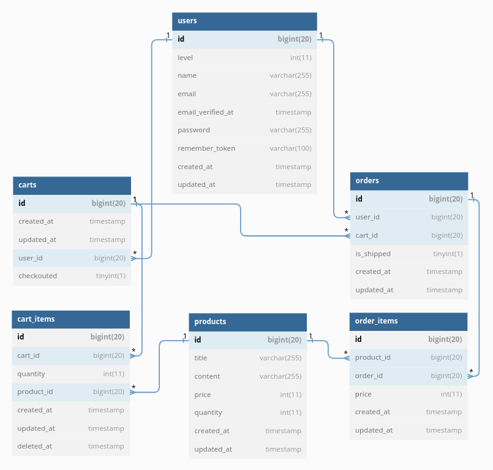

# Ecommerce API Server
Docker compose to setup php and mysql for Laravel 8.  

Function:
- Cart CRUD
- Auth Signup, Login, Logout
- Checkout
- VIP Discount
- Check Quantity

Demo:<br>
https://www.youtube.com/embed/ko44wq1JANk

## Environment
- Ubuntu 22.04
- Docker 20.10.18

### Directory Structure
```sh
ecommerce-laravel
├── ...
├── Makefile
├── Dockerfile
├── docker-compose.yml
├── .env
├── php.ini
└── images
```
- ... : Laravel files. Use [Laravel-8.1.0](https://github.com/laravel/laravel/tree/v8.1.0).
- images : README.md images.

### Docker Images
1. php → php:7.4-fpm-alpine
2. mysql → mysql:5.7.22

### Deployment using Docker
1. Deploy php-fpm, and mysql using Makefile
    ```bash
    make up
    ```
2. Stop all containers
    ```bash
    make stop
    ```
3. Close all containers
    ```bash
    make down
    ```
4. Remove all containers and images
    ```bash
    make rm
    ```
4. Restart (Rebuild all images and containers)
    ```bash
    make restart
    ```

## Develop 
1. go in `php`
    ```bash
    docker exec -it ecommerce-backend sh
    /var/www $

    # write `php artisan` and `composer` code, for example:
    /var/www $ php artisan migrate
    /var/www $ composer dump-autoload
    ```
2. go in `mysql`
    ```bash
    docker exec -it ecommerce-db mysql -u root -p
    ```

## SQL Structure
export the AQL structure
```sh
docker exec -it ecommmerce-db mysqldump -u root -proot --no-data -d chart > chart.sql
```
draw diagram in [dbdiagram](https://dbdiagram.io/d/63b3b3ce7d39e42284e88c94)



## TODO
- [ ] Swagger
- [ ] UML
- [ ] Add Contrained cart_id, product_id to cartItems
- [ ] Create SuperUser
    - Set User Level API
    - Fix Product CUD
- [ ] Review MVC and `php artisan` command
- [ ] Demo Video
- [ ] Nginx
- [ ] Grafana + AlertManager


## Reference
- https://hiskio.com/courses/429/announcements